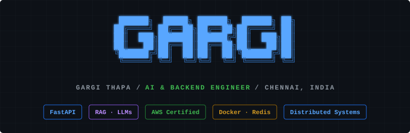

<!-- ═══════════════════════════════════════════════════════════════════════════
     GARGI THAPA — GitHub Profile README
     Auto-updated via .github/workflows/update-stats.yml
     ═══════════════════════════════════════════════════════════════════════════ -->

<div align="center">

<!-- ─── HEADER ─────────────────────────────────────────────────────────── -->



<br/>


</div>

---

<!-- ─── ABOUT.ME ───────────────────────────────────────────────────────── -->

<h3><code>// ABOUT.ME</code></h3>

<div align="center">

</div>

<br/>

```
>>> Building systems that are intelligent and production-ready.
>>> 89% precision RAG pipelines. 2400+ tasks/min distributed engines.
>>> Sub-800ms P95 latency in enterprise-scale deployments.
```

---

<!-- ─── CONTRIBUTION STATS ─────────────────────────────────────────────── -->

<h3><code>// CONTRIBUTION.STATS</code></h3>

<!-- 🔄 Auto-generated by scripts/update_stats.py — do not edit manually -->
<div align="center">

</div>

<br/>

<!-- ─── CONTRIBUTION GRAPH ─────────────────────────────────────────────── -->

<div align="center">

</div>

---

<!-- ─── TECH STACK ─────────────────────────────────────────────────────── -->

<h3><code>// TECH.STACK</code></h3>

<table>
<tr>
<td valign="top" width="50%">

**AI & ML**


</td>
<td valign="top" width="50%">

**Backend & APIs**


</td>
</tr>
<tr>
<td valign="top" width="50%">

**Databases & Cache**


</td>
<td valign="top" width="50%">

**Infrastructure**


</td>
</tr>
</table>

---

<!-- ─── EXPERIENCE LOG ─────────────────────────────────────────────────── -->

<h3><code>// EXPERIENCE.LOG</code></h3>

<table>
<tr>
<td>

**AI Infrastructure Engineer Intern** &nbsp;&nbsp;&nbsp;&nbsp;&nbsp;&nbsp;&nbsp;&nbsp;&nbsp;&nbsp;&nbsp;&nbsp;&nbsp;&nbsp;&nbsp;&nbsp;&nbsp;&nbsp;&nbsp;&nbsp;&nbsp;&nbsp;&nbsp;&nbsp;&nbsp;&nbsp;&nbsp;&nbsp;&nbsp;&nbsp;&nbsp;&nbsp;&nbsp;&nbsp;&nbsp;&nbsp;&nbsp;&nbsp;&nbsp;&nbsp;&nbsp;&nbsp;&nbsp;&nbsp;&nbsp;&nbsp;&nbsp; `Dec 2025 – Jan 2026`
<br/><sub>DappaSol</sub>

- FastAPI + FAISS + OpenAI Embeddings — 89% retrieval precision@5 across 500K+ indexed docs
- Async ingestion pipeline with per-tenant namespace isolation; sub-800ms P95 for NY enterprise client

</td>
</tr>
<tr>
<td>

**Software Engineering Intern** &nbsp;&nbsp;&nbsp;&nbsp;&nbsp;&nbsp;&nbsp;&nbsp;&nbsp;&nbsp;&nbsp;&nbsp;&nbsp;&nbsp;&nbsp;&nbsp;&nbsp;&nbsp;&nbsp;&nbsp;&nbsp;&nbsp;&nbsp;&nbsp;&nbsp;&nbsp;&nbsp;&nbsp;&nbsp;&nbsp;&nbsp;&nbsp;&nbsp;&nbsp;&nbsp;&nbsp;&nbsp;&nbsp;&nbsp;&nbsp;&nbsp;&nbsp;&nbsp;&nbsp;&nbsp;&nbsp;&nbsp;&nbsp;&nbsp;&nbsp;&nbsp;&nbsp;&nbsp;&nbsp;&nbsp;&nbsp;&nbsp;&nbsp;&nbsp;&nbsp;&nbsp;&nbsp; `Jun – Aug 2025`
<br/><sub>Ericsson</sub>

- Concurrent Python ETL pipelines — 40% reduction in manual ingestion overhead
- Modular Flask microservices with structured logging across 3+ backend service modules

</td>
</tr>
<tr>
<td>

**Bridge Trainee — Fintech Backend** &nbsp;&nbsp;&nbsp;&nbsp;&nbsp;&nbsp;&nbsp;&nbsp;&nbsp;&nbsp;&nbsp;&nbsp;&nbsp;&nbsp;&nbsp;&nbsp;&nbsp;&nbsp;&nbsp;&nbsp;&nbsp;&nbsp;&nbsp;&nbsp;&nbsp;&nbsp;&nbsp;&nbsp;&nbsp;&nbsp;&nbsp;&nbsp;&nbsp;&nbsp;&nbsp;&nbsp;&nbsp;&nbsp;&nbsp;&nbsp;&nbsp;&nbsp;&nbsp;&nbsp;&nbsp;&nbsp;&nbsp;&nbsp;&nbsp;&nbsp;&nbsp;&nbsp;&nbsp;&nbsp;&nbsp;&nbsp;&nbsp; `Mar 2026`
<br/><sub>Citi</sub>

- Enterprise fintech systems, secure dev practices & AI in financial services

</td>
</tr>
</table>

---

<!-- ─── PROJECTS ───────────────────────────────────────────────────────── -->

<h3><code>// PROJECTS</code></h3>

<table>
<tr>
<td width="50%">

### ⚙ [AegisFlow](https://github.com/gaaarrrgiiiiiiiiiii/AegisFlow)

`FastAPI` · `Redis Streams` · `PostgreSQL` · `Docker` · `AWS`

Distributed async task orchestration engine. Exactly-once execution, circuit breakers, exponential-backoff DLQ, JWT-authenticated multi-tenant REST API.


</td>
<td width="50%">

### 🛡 [CortexGate](https://github.com/gaaarrrgiiiiiiiiiii/CortexGate)

`FastAPI` · `Redis` · `PostgreSQL` · `JWT` · `Docker` · `AWS`

Multi-tenant API gateway with Redis caching, dynamic upstream failover, per-tenant rate limiting, usage metering, and circuit breakers under fault injection.


</td>
</tr>
</table>

---

<!-- ─── CERTIFICATIONS ─────────────────────────────────────────────────── -->

<h3><code>// CERTIFICATIONS</code></h3>

<table>
<tr>
<td width="50%" align="center">

🏅 **AWS Certified AI Practitioner**
<br/><sub>Amazon Web Services · 2026</sub>

</td>
<td width="50%" align="center">

🏅 **AWS Certified Cloud Practitioner**
<br/><sub>Amazon Web Services · 2026</sub>

</td>
</tr>
</table>

---

<!-- ─── CONNECT ────────────────────────────────────────────────────────── -->

<h3><code>// CONNECT</code></h3>

<table>
<tr>
<td width="50%">

📧 &nbsp;**email**
<br/>&nbsp;&nbsp;&nbsp;&nbsp;&nbsp;&nbsp;[gargith24@gmail.com](mailto:gargith24@gmail.com)

</td>
<td width="50%">

🔗 &nbsp;**linkedin**
<br/>&nbsp;&nbsp;&nbsp;&nbsp;&nbsp;&nbsp;[gargi-thapa](https://linkedin.com/in/gargi-thapa)

</td>
</tr>
</table>

---

<div align="center">

🟢 &nbsp;**open to opportunities** &nbsp;· &nbsp;graduating May 2027 &nbsp;· &nbsp;Chennai, India

</div>
