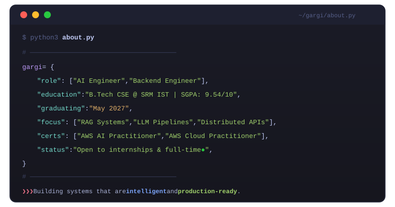

<!-- ═══════════════════════════════════════════════════════════════════════════
     GARGI THAPA — GitHub Profile README
     Auto-updated via .github/workflows/update-stats.yml
     ═══════════════════════════════════════════════════════════════════════════ -->

<div align="center">

<!-- ─── HEADER ─────────────────────────────────────────────────────────── -->


<br/>


</div>

---

<!-- ─── ABOUT.ME ───────────────────────────────────────────────────────── -->

<h3><code>// ABOUT.ME</code></h3>

<div align="center">

</div>

<br/>

```
>>> Building systems that are intelligent and production-ready.
>>> 89% precision RAG pipelines. 2400+ tasks/min distributed engines.
>>> Sub-800ms P95 latency in enterprise-scale deployments.
```

---

<!-- ─── CONTRIBUTION STATS ─────────────────────────────────────────────── -->

<h3><code>// CONTRIBUTION.STATS</code></h3>

<!-- 🔄 Auto-generated by scripts/update_stats.py — do not edit manually -->
<div align="center">

</div>

<br/>

<!-- ─── CONTRIBUTION GRAPH ─────────────────────────────────────────────── -->

<div align="center">

</div>

---

<!-- ─── TECH STACK ─────────────────────────────────────────────────────── -->

<h3><code>// TECH.STACK</code></h3>

<div align="center">

</div>

---

<!-- ─── EXPERIENCE LOG ─────────────────────────────────────────────────── -->

<h3><code>// EXPERIENCE.LOG</code></h3>

<div align="center">

</div>

---

<!-- ─── PROJECTS ───────────────────────────────────────────────────────── -->

<h3><code>// PROJECTS</code></h3>

<div align="center">
<a href="https://github.com/gaaarrrgiiiiiiiiiii?tab=repositories">

</a>
</div>

---

<!-- ─── CERTIFICATIONS ─────────────────────────────────────────────────── -->

<h3><code>// CERTIFICATIONS</code></h3>

<div align="center">

</div>

---

<!-- ─── CONNECT ────────────────────────────────────────────────────────── -->

<h3><code>// CONNECT</code></h3>

<div align="center">
<a href="https://www.linkedin.com/in/gargi-thapa-089767294/">

</a>
</div>

---

<div align="center">

🟢 &nbsp;**open to opportunities** &nbsp;· &nbsp;graduating May 2027 &nbsp;· &nbsp;Chennai, India

</div>
